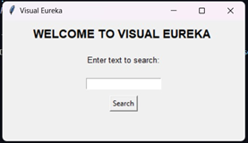
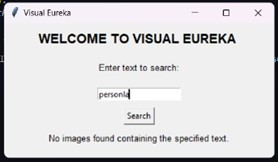
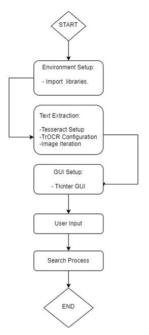

# VisualEureka

## Introduction
Within the domain of text extraction technologies, progress has been somewhat constrained, notwithstanding notable instances such as Google Lens, which proficiently extracts text from images. A conspicuous gap persists, however, in the availability of software tailored for the reciprocal task of searching images based on their textual content. Our pioneering conceptual framework introduces a transformative paradigm shift—a software solution engineered for image retrieval through text search. The crux of our technical innovation lies in the systematic incorporation of metadata as a repository for textual data linked to images. Through advanced text extraction algorithms, including robust optical character recognition methods, we decipher and store relevant textual information in this metadata. This meticulous indexing facilitates a highly efficient search mechanism, allowing users to query images based on specific text-related parameters. The user interface seamlessly integrates these functionalities, providing an intuitive platform for users to input text queries and retrieve images with unprecedented precision. Scalability and performance optimization measures ensure the system's adaptability to growing datasets, promising not only a redefined utility of image search but also a significant advancement in user convenience and operational efficiency within the visual data retrieval landscape.

## Output images

### Picture 1

### Picture 2

### Picture 3

## Flow Chart

